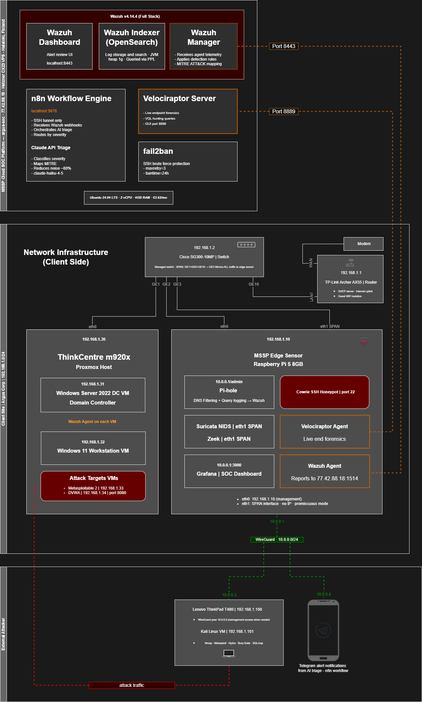

# Argus SOC

## AI-Augmented Home Lab Security Operations Center
> *Edge to cloud. Threat to response.*

**Status:** Phases 0–5 complete. Phase 6 (Automated PDF Reporting) and Phase 7 (Active Directory attack scenarios) in progress.


---

A home lab Security Operations Centre built on a cloud-hosted central platform and on-premise enterprise infrastructure. The lab is modelled on how a Managed Security Service Provider (MSSP) operates — a cloud SOC platform monitors a separate client enterprise network through an MSSP-deployed edge sensor — and demonstrates hands-on work across the security kill chain: network monitoring, threat detection, AI-powered alert triage, live endpoint forensics, incident response, and automated reporting.

> This is a home lab portfolio project. All attacks are executed against intentionally vulnerable services in a controlled lab environment. No real-world systems are tested.

Argus SOC is built around an **attack → gap → fix → re-test** pattern. Every red team scenario documents what the detection stack initially missed, the custom rules written to close the gap, and the re-test verification — including evidence of what the stack *failed* to detect on first run.

---

## 🏗️ Architecture — MSSP Topology

[](docs/assets/argus-soc-home-lab-architecture.png)
*Click to enlarge.*

The lab uses a three-tier architecture that mirrors how real MSSPs operate:

- **Cloud SOC Platform (Hetzner VPS, Helsinki)** — the central platform where all telemetry lands, alerts are processed, and the operator works. GDPR-compliant, x86_64.
- **Client Enterprise Infrastructure (ThinkCentre M920x running Proxmox)** — a small Active Directory enterprise: domain controller, domain-joined Windows 11 workstation, and intentionally vulnerable services. This is the monitored environment.
- **MSSP Edge Sensor (Raspberry Pi 5)** — deployed at the client site, captures all network traffic via Cisco SG300 SPAN, runs the NIDS and protocol analyser, and forwards logs to the cloud SOC platform.

The attacker (Kali VM on a ThinkPad) operates on the same subnet as the targets. The Pi 5 sees every packet on the switch via SPAN, and the Hetzner platform receives every alert generated by the edge.

---

## 🖥️ Node Roles

| Node | Hardware | Role | Key Services |
|------|----------|------|--------------|
| **argus-soc** | Hetzner CX23 (2 vCPU, 4GB, x86_64, Helsinki) | MSSP Cloud SOC Platform | Wazuh Manager + Indexer + Dashboard, n8n, Velociraptor server, Claude API triage |
| **argus-hypervisor** | ThinkCentre M920x (i7-8700, 32GB DDR4, Proxmox VE) | Client Enterprise Infrastructure | Windows Server 2022 (DC01 — Active Directory), Windows 11 (WS01 — domain-joined), Metasploitable 2, DVWA |
| **argus-central** | Raspberry Pi 5 (8GB) | MSSP Edge Sensor + Admin Tools | Suricata NIDS (SPAN), Zeek, Cowrie SSH honeypot, Wazuh Agent, Velociraptor Agent, Pi-hole DNS, WireGuard VPN server, Grafana |
| **Red Team** | Lenovo ThinkPad T480 / Kali VM | Attacker | Nmap, Metasploit, Hydra, SQLmap |

---

## ⚡ The AI Detection Loop

Every Wazuh alert above threshold flows through an automated triage pipeline on the Hetzner VPS:

```
Traffic Capture (Suricata + Zeek on Pi 5 SPAN interface)
       ↓
Detection Layer
  ├── Suricata: Signature matching (ET Open ruleset, 49,325 rules + custom rules)
  └── Zeek: Protocol metadata (conn.log, dns.log, http.log, ssl.log)
       ↓
Log Forwarding (Wazuh Agent → Hetzner Manager — direct over internet, port 1514)
       ↓
SIEM Correlation (Wazuh: multi-source, MITRE ATT&CK mapping, custom rules)
       ↓
Webhook Trigger (Wazuh → n8n at level 3+, localhost:5678)
       ↓
AI Triage (Claude API: classify severity, MITRE tag, plain-English summary)
       ↓
Severity Routing (n8n Switch node)
    ├── Noise     → Silent log
    ├── Low       → Daily digest
    ├── Medium    → Telegram alert
    └── Critical  → Telegram + PagerDuty escalation (EU instance)
```

**Claude API output schema:**

```json
{
  "severity": "noise | low | medium | critical",
  "summary": "Plain-English explanation of what happened and why it matters",
  "mitre_technique": "T1190",
  "mitre_technique_name": "Exploit Public-Facing Application",
  "recommended_action": "respond_immediately",
  "confidence": 0.97,
  "reasoning": "Why this classification was chosen"
}
```

> In testing, Claude correctly classifies ~80% of ET Open rule hits as noise — transforming hundreds of daily raw alerts into ~20–40 actionable items, with critical events surfaced immediately.

---

## 🛠️ Tech Stack

| Layer | Tool |
|-------|------|
| Cloud Platform | Hetzner CX23 (Helsinki, GDPR-compliant) |
| SIEM | Wazuh v4.14.4 (Manager + Indexer + Dashboard) |
| NIDS | Suricata (ET Open ruleset + custom rules) |
| Protocol Analysis | Zeek |
| DFIR | Velociraptor |
| Hypervisor | Proxmox VE 9.1.7 |
| Identity | Windows Server 2022 — Active Directory Domain Services |
| Workstation | Windows 11 Enterprise (domain-joined) |
| Traffic Visibility | Cisco SG300-10MP managed switch (hardware SPAN) |
| AI Triage | Claude API (Anthropic) |
| Workflow Engine | n8n (self-hosted) |
| Operator Alerting | Telegram Bot |
| Escalation | PagerDuty (EU instance) |
| VPN | WireGuard |
| Honeypot | Cowrie SSH |
| Attack Targets | Metasploitable 2, DVWA |
| Dashboards | Grafana |
| DNS Filtering | Pi-hole v6 |
| Reporting | Jinja2 + WeasyPrint *(planned — Phase 6)* |
| Red Team | Kali Linux |

---

## 🎯 Attack Scenarios — Detection Coverage

Five red team scenarios covering the kill chain. Each scenario follows the **attack → gap → fix → re-test** pattern, documented in full on the build blog.

| # | Scenario | MITRE Technique | Initial Detection | After Remediation | Blog Post |
|---|----------|-----------------|-------------------|-------------------|-----------|
| 1 | Reconnaissance (Nmap) | T1046 | Partial (protocol anomalies only) | ET SCAN firing — 199 hits | [Read →](https://al3grus.github.io/posts/argus-soc-phase-4-scenario-1/) |
| 2 | Credential Brute Force (Hydra) | T1110.001 | Full detection | N/A — full pipeline first time | [Read →](https://al3grus.github.io/posts/argus-soc-phase-4-scenario-2/) |
| 3 | Remote Code Execution (UnrealIRCd) | T1190 | Zero detection | 12 CRITICAL alerts after custom rules | *(coming soon)* |
| 4 | Web Application Attacks (SQLmap) | T1190 | Zero detection | 33 alerts, SQLmap identified | *(coming soon)* |
| 5 | Lateral Movement (pivot) | T1021 | Partial (Claude classified as LOW) | CRITICAL, T1021 mapped after rule update | *(coming soon)* |

Active Directory-specific scenarios (Kerberoasting, AS-REP roasting, DCSync, lateral movement on Windows) are planned for Phase 7.

---

## 🗺️ MITRE ATT&CK Coverage

| Technique | Name | Tactic | Primary Detection | Confidence |
|-----------|------|--------|-------------------|------------|
| T1046 | Network Service Discovery | Discovery | Suricata ET SCAN + Zeek conn.log | High (aggressive) / Low (stealth) |
| T1110.001 | Brute Force: Password Guessing | Credential Access | Cowrie + Wazuh custom rules | High |
| T1190 | Exploit Public-Facing Application | Initial Access | Custom Suricata SID + Wazuh rule | High (after remediation) |
| T1059 | Command and Scripting Interpreter | Execution | Custom Suricata + Wazuh rule (reverse shell) | High (after remediation) |
| T1021 | Remote Services | Lateral Movement | Wazuh custom rule (server IP escalation) | High (after remediation) |
| T1078 | Valid Accounts | Defence Evasion | Cowrie + Wazuh rule | Medium |

---

## 🚀 Build Progress

| Phase | Description | Status |
|-------|-------------|--------|
| **Phase 0** | Core Infrastructure — Hetzner Wazuh stack, MSSP edge sensor, WireGuard, Pi-hole, Cisco SG300 SPAN | ✅ Complete |
| **Phase 1** | AI Triage Pipeline — n8n, Claude API, Telegram, PagerDuty | ✅ Complete |
| **Phase 2** | Threat Intel + Honeypot — Cowrie SSH honeypot, Kali attacker | ✅ Complete |
| **Phase 3** | Pre-Attack Setup — Velociraptor DFIR, Grafana SOC dashboard | ✅ Complete |
| **Phase 4** | Red Team Scenarios + Detection Engineering — 5 scenarios, attack → gap → fix → re-test | ✅ Complete |
| **Phase 5** | Hardening + Architecture Migration — Hetzner / Pi 5 / router hardening, M920x onboarding, Proxmox, Active Directory lab build | ✅ Complete |
| **Phase 6** | Automated PDF Reporting — Jinja2 + WeasyPrint pipeline | ⏳ Pending |
| **Phase 7** | Active Directory Attack Scenarios — Kerberoasting, AS-REP roasting, DCSync, Windows lateral movement | ⏳ Planned |

---

## 📝 Build Blog

Every phase is documented as it completes at **[al3grus.github.io](https://al3grus.github.io)** — including real-world complications, troubleshooting, gap analysis, and lessons learned. The blog is the canonical record of how this build was actually carried out.

---

## ⚠️ Disclaimer

All work uses sanitised data in controlled lab environments. No unauthorised access or testing of real systems.

---

## 📄 License

[MIT](LICENSE) — attribution appreciated.

---

*Originally created by Ricardo Infante, 2026. Documented at [al3grus.github.io](https://al3grus.github.io).*