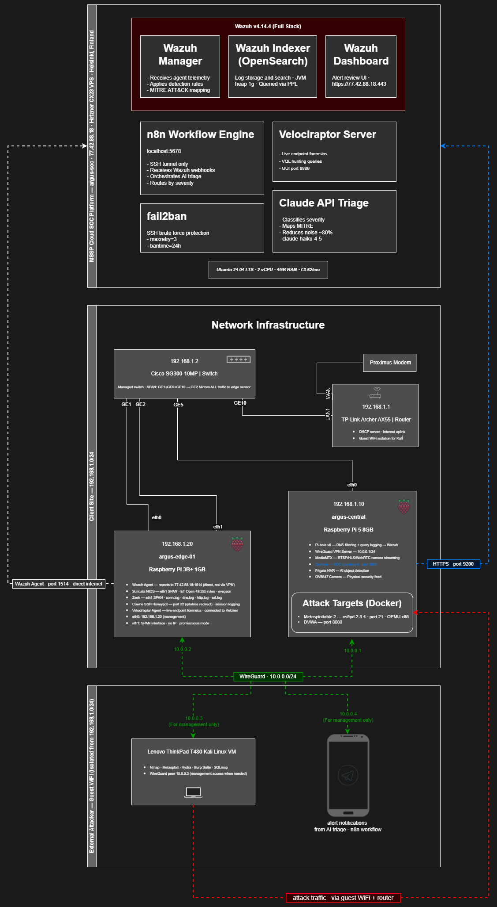

# Architecture — MSSP Topology

## Overview

Argus SOC uses a three-tier architecture that mirrors how commercial MSSPs and MDR providers operate. Every architectural decision maps to a real-world MSSP pattern and is justified against what a production deployment would look like.

---

_Argus SOC — Three-tier MSSP topology. Click to enlarge._

---

## The Three Tiers

### Tier 1 — Cloud SOC Platform (Hetzner VPS)

The MSSP runs a central platform in the cloud. This is where all telemetry lands, alerts are processed, and the operator works. The client never touches this. In a real MSSP, this is their data centre. In Argus SOC, it is a Hetzner CX23 VPS in Helsinki (GDPR-compliant, x86_64).

**Why Hetzner instead of Pi 5?** Real MSSPs run cloud-hosted central platforms. Edge sensors at client sites report back over the internet. This is exactly what Argus SOC does.

**Services running on Hetzner:**
- Wazuh Manager + Indexer + Dashboard (full stack)
- n8n workflow engine (co-located with Wazuh — webhooks stay on localhost)
- Velociraptor server
- Claude API triage scripts
- Jinja2 + WeasyPrint PDF report generation

---

### Tier 2 — Client Infrastructure (Pi 5)

In a real MSSP engagement, the client has their own network infrastructure — routers, DNS servers, workstations, internal applications. The MSSP sensor sits alongside this and monitors it. Pi 5 plays this role: it is the **client's existing infrastructure** that the MSSP has been hired to protect.

This positioning is deliberate and architecturally honest. Pi 5 is not part of the MSSP toolchain — it is the monitored environment. It runs services a real client site would run (DNS, local reporting dashboards, a camera system), plus intentionally vulnerable Docker containers that serve as attack targets.

**Services running on Pi 5 (192.168.1.10):**
- Pi-hole v6 — DNS filtering and query logging as telemetry
- WireGuard VPN server (10.0.0.1) — management tunnel between devices
- Grafana — client-facing security posture dashboards
- MediaMTX — RTSP/HLS/WebRTC camera streaming
- Frigate NVR — AI object/motion detection
- OV5647 NoIR camera (CSI)
- Metasploitable 2 (Docker) — intentionally vulnerable attack target
- DVWA (Docker) — intentionally vulnerable web application

---

### Tier 3 — MSSP Edge Sensor (Pi 3B+)

At each client site, the MSSP deploys a small hardware sensor. It captures all network traffic via SPAN port, runs the NIDS, forwards logs to the cloud platform, and phones home over an encrypted tunnel. The client does not manage it. Pi 3B+ plays this role exactly.

**Services running on Pi 3B+ (192.168.1.20):**
- Wazuh Agent — forwards all logs to Hetzner Manager (direct, port 1514, not via WireGuard)
- Suricata NIDS — signature detection on eth1 SPAN interface (ET Open, 49,325 rules)
- Zeek — protocol metadata analysis on eth1 SPAN interface
- Cowrie SSH honeypot — full attacker session capture
- Velociraptor agent — live endpoint forensics

---

### The Attacker (ThinkPad on Guest WiFi)

The ThinkPad runs Kali Linux and operates from the guest WiFi network — isolated from the client site (192.168.1.0/24). This simulates an external attacker approaching from the internet. For attack scenarios, Kali reaches Pi 5's Docker containers via WireGuard tunnel (10.0.0.3 → 192.168.1.10).

The Cisco SG300 SPAN captures all traffic between Pi 5 (GE5) and the router uplink (GE10), so Suricata sees every attack regardless of the attacker's network position.

---

## Network Design

### Single Flat Subnet

All client site devices share a single subnet: `192.168.1.0/24`. The TP-Link Archer AX55 router does not support 802.1Q LAN VLANs. Rather than fight the hardware, the architecture uses a flat subnet with the Cisco SG300 SPAN capturing all traffic — which is sufficient for the NIDS to see everything it needs to see.

| Device | IP | Connection |
|--------|-----|-----------|
| Router | 192.168.1.1 | — |
| Cisco SG300-10MP (management) | 192.168.1.2 | GE10 → Router |
| Pi 5 (argus-central) | 192.168.1.10 | GE5 → Switch |
| Pi 3B+ (argus-edge-01) | 192.168.1.20 | GE1 → Switch (eth0) |

### WireGuard VPN Topology

WireGuard provides encrypted management tunnels between devices. Note: Wazuh Agent traffic goes **directly from Pi 3B+ to Hetzner over the internet (port 1514)** — not through WireGuard. WireGuard is for SSH management access only.

| Device | Tunnel IP | Role |
|--------|-----------|------|
| Pi 5 (argus-central) | 10.0.0.1/24 | Server — listens UDP 51820 |
| Pi 3B+ (argus-edge-01) | 10.0.0.2/32 | Peer |
| ThinkPad | 10.0.0.3/32 | Peer (management access) |
| Phone (alert device) | 10.0.0.4/32 | Peer |

### SPAN Port Architecture

The Cisco SG300-10MP mirrors all switch traffic to Pi 3B+ eth1. Both Suricata and Zeek listen passively on this interface — no IP address assigned.

| Switch Port | Connection | Purpose |
|-------------|-----------|---------|
| GE1 | Pi 3B+ eth0 | Normal network connectivity |
| GE2 | Pi 3B+ eth1 (USB adapter) | SPAN mirror destination — NO IP, promiscuous |
| GE5 | Pi 5 | Client infrastructure |
| GE10 | Router | Internet uplink |

**SPAN configuration:** GE1 + GE5 + GE10 → GE2, both directions (Tx and Rx)

Without SPAN, Suricata and Zeek would only see traffic addressed to the Pi 3B+ itself. With SPAN, they see all traffic between all switch-connected devices — including attacks against Pi 5's Docker containers that never touch the Pi 3B+ directly.

---

## Data Flow — Security Event Lifecycle

Every step an alert takes from initial packet to operator notification:

1. **Traffic Capture** — Suricata and Zeek on Pi 3B+ eth1 see all switch traffic via SPAN
2. **Detection** — Suricata matches ET Open signatures; Zeek generates protocol metadata
3. **Log Forwarding** — Wazuh Agent on Pi 3B+ forwards to Hetzner Manager (port 1514, direct internet)
4. **SIEM Correlation** — Wazuh correlates multi-source events, maps MITRE ATT&CK
5. **Webhook Trigger** — Alerts at level 3+ fire to n8n (localhost:5678/webhook/wazuh-alert)
6. **AI Triage** — n8n sends alert JSON to Claude API; structured classification returned
7. **Severity Routing** — n8n routes by Claude's severity: noise → log only, low → digest, medium → Telegram, critical → Telegram + PagerDuty
8. **Operator Alert** — Telegram Bot sends formatted message with severity, summary, IPs, MITRE technique
9. **Escalation** — Critical alerts create PagerDuty incidents (EU endpoint); auto-escalate if unacknowledged

### Physical Security Path

Camera events use the same pipeline:

1. OV5647 camera → MediaMTX (RTSP :8554)
2. Frigate pulls RTSP → AI object/motion detection
3. Frigate events → Wazuh Agent (Pi 5) → Hetzner Manager
4. Same n8n → Claude → Telegram pipeline as network events

---

## Tool Selection Rationale

Every tool was evaluated against alternatives before selection.

| Layer | Selected | Rejected | Reason for rejection |
|-------|----------|----------|---------------------|
| **Cloud Platform** | Hetzner CX23 | Pi 5 as SOC brain | Wazuh Indexer/Dashboard have no ARM64 packages |
| **SIEM** | Wazuh | Splunk, Elastic SIEM | Splunk: licensing cost. Elastic: 8-16GB RAM minimum, impossible on Pi |
| **NIDS** | Suricata | Snort, Zeek alone | Snort: single-threaded. Zeek: protocol analysis only, not signature matching |
| **Protocol Analysis** | Zeek | Suricata alone | Complements Suricata — protocol metadata catches what signatures miss |
| **DFIR** | Velociraptor | osquery | Velociraptor: live forensics + VQL hunting. Used by real incident responders. |
| **Traffic Visibility** | Cisco SG300 SPAN | Software TAP | Software TAPs add latency and packet loss. Hardware SPAN is the correct approach. |
| **AI Triage** | Claude API | LangChain, GPT-4, local LLMs | LangChain: unnecessary abstraction for single-step calls. GPT-4: higher cost. Local LLMs: insufficient quality at 7B parameter scale. |
| **Workflow** | n8n | Custom Python scripts | Python scripts: harder to maintain and demonstrate. n8n visual workflows are immediately understandable. |
| **Alerting** | Telegram Bot | Discord, Slack, email | Discord: gaming connotations. Slack: paid workspace for reliable webhooks. Email: too slow. |
| **Escalation** | PagerDuty (EU) | OpsGenie, custom scripts | OpsGenie: Atlassian lock-in. Scripts: cannot replicate phone/SMS escalation. |
| **VPN** | WireGuard | OpenVPN, Tailscale | OpenVPN: heavier, user-space. Tailscale: hides the VPN mechanics you want to demonstrate. |
| **Honeypot** | Cowrie | Kippo, Honeyd | Kippo: deprecated. Honeyd: lower fidelity, no interactive shell simulation. |
| **Reporting** | Jinja2 + WeasyPrint | LaTeX, FPDF | LaTeX: overcomplicated. FPDF: less flexible than HTML/CSS-based rendering. |

---

## Why Two Raspberry Pis?

Running everything on Pi 5 would be technically possible. The two-device setup demonstrates patterns that a single-device setup cannot:

- **MSSP edge sensor topology** — Pi 3B+ simulates a remote sensor deployed at a client site. This is how MSSP actually work.
- **Multi-agent SIEM** — Wazuh Agent registration, key exchange, and health monitoring across a network boundary are real operational skills.
- **East-west traffic detection** — Lateral movement simulation (Scenario 5) requires separate hosts. Pivoting from Metasploitable to Pi 3B+ is only meaningful when they are physically separate machines.
- **VPN keepalive monitoring** — WireGuard keepalive monitoring that alerts when the edge node goes offline is a real SOC use case.

---

## Memory Planning

### Hetzner CX23 (4GB RAM)

| Service | Est. RAM | Notes |
|---------|----------|-------|
| Wazuh Indexer (OpenSearch) | 1.0–1.5 GB | JVM heap: -Xms1g -Xmx1g |
| Wazuh Manager | 300–500 MB | Scales with agent count |
| Wazuh Dashboard | 160–250 MB | Node.js process |
| n8n | 200–400 MB | SQLite mode |
| Velociraptor server | 100–200 MB | Go binary |
| OS + overhead | 200–300 MB | |
| **Total** | **~2.0–3.1 GB** | Comfortable within 4GB |

### Pi 5 (8GB RAM)

| Service | Est. RAM | Notes |
|---------|----------|-------|
| Pi-hole + FTL | 200–300 MB | Lightweight |
| WireGuard | 50–100 MB | Kernel module |
| Grafana | 150–250 MB | Can stop when not viewing |
| MediaMTX | 50–100 MB | RTSP streaming |
| Frigate | 500 MB–1 GB | Depends on detection model |
| Metasploitable 2 (Docker) | 256–512 MB | JVM-based services |
| DVWA (Docker) | 64–128 MB | PHP/Apache |
| OS + overhead | 300–500 MB | |
| **Total** | **~1.6–2.9 GB** | Comfortable within 8GB |

### Pi 3B+ (1GB RAM)

| Service | Est. RAM | Notes |
|---------|----------|-------|
| Wazuh Agent | 50–80 MB | Lightweight |
| Suricata | 200–350 MB | stream.memcap=32mb, flow.memcap=32mb |
| Zeek | 100–200 MB | Low-resource profile |
| Cowrie | 50–80 MB | Python-based |
| Velociraptor agent | 50–80 MB | Go binary |
| WireGuard + OS | 150–200 MB | |
| **Total** | **~600–990 MB** | Tight — monitor with htop continuously |

> **Warning:** If Pi 3B+ approaches 900MB, check Suricata memcap settings first — most common culprit is default memcap (256MB each for stream and flow). The configured values of 32MB each are correct.
